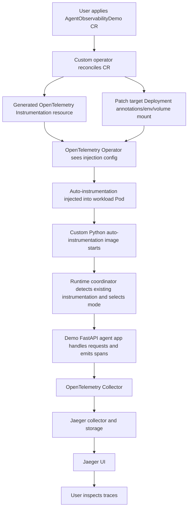

# agent-observability-operator

`agent-observability-operator` is a complete, self-contained proof of concept for **Python agent observability on Kubernetes**.

It shows how to take a user-facing custom resource, reconcile it into the OpenTelemetry resources and workload mutations needed for injection, start a **custom Python auto-instrumentation image**, make a **runtime coordinator** choose an instrumentation mode at process startup, and deliver traces end to end through an **OpenTelemetry Collector** into **Jaeger**.

The repository is designed to be understandable and runnable by another engineer without needing external glue code.

## Problem statement

Stock OpenTelemetry Operator injection is powerful, but it is **not sufficient by itself** for this agent observability use case.

Why not:

- **Injection alone does not provide a user-facing source of truth.** In this PoC, the platform contract is the custom `AgentObservabilityDemo` resource, not a manually authored `Instrumentation` object.
- **Injection alone does not decide instrumentation ownership.** Python agent workloads may have no tracing, partial tracing signals, or fully user-owned tracing already in place. A blanket auto-instrumentation startup path risks duplicate spans, conflicting SDK setup, or overriding app-owned tracing.
- **Injection alone does not express runtime coordination policy.** This PoC needs startup-time instrumentation decisions for each framework and component, based on detection of what's already configured or instrumented.
- **Injection alone does not ship the custom runtime behavior.** The PoC uses a custom Python auto-instrumentation image that contains curated instrumentation packages plus a runtime coordinator invoked via `sitecustomize.py`.
- **Injection alone does not prepare the workload the way this demo needs.** The custom operator patches the target workload, mounts runtime coordinator config, writes OTLP settings, and points the OTel Operator at the generated `Instrumentation` resource.

In short: the standard OTel Operator remains an important part of the system, but this PoC demonstrates the extra control plane and runtime policy required to make agent observability safer and more intentional for Python workloads.

## What this PoC demonstrates

This repository demonstrates all of the following, end to end:

- **custom CR as source of truth** via `AgentObservabilityDemo` resources that describe the target workload, generated instrumentation, and runtime coordinator settings.
- **generated OpenTelemetry `Instrumentation` resources** created by the custom operator rather than managed manually by the user.
- **Workload patching for OTel Operator injection** so Deployments are annotated and configured for Python auto-instrumentation.
- **A custom Python auto-instrumentation image** that packages OTel libraries and instrumentors but delegates activation policy to the runtime coordinator.
- **A runtime coordinator** that detects existing tracing ownership signals and makes fine-grained instrumentation decisions at startup.
- **Collector + Jaeger backend wiring** so traces travel from the demo agent app to the OpenTelemetry Collector and then to Jaeger.
- **three instrumentation ownership cases** represented by demo apps:
  - `no-existing`: no tracing setup; coordinator should initialize provider and instrument all available frameworks
  - `partial-existing`: some tracing ownership signals exist; coordinator should make selective decisions
  - `full-existing`: app fully owns provider/exporter and some manual instrumentation; coordinator should respect existing setup

## Architecture overview

### End-to-end flow



### Telemetry path

```text
agent app
  -> OTLP HTTP (agent-observability-collector.observability.svc.cluster.local:4318)
  -> OpenTelemetry Collector
  -> Jaeger collector
  -> Jaeger UI (agent-observability-jaeger.observability.svc.cluster.local:16686)
```

### Stable service names

- Collector: `agent-observability-collector.observability.svc.cluster.local`
- Jaeger UI: `agent-observability-jaeger.observability.svc.cluster.local`
- Demo apps:
  - `agent-no-existing.demo-apps.svc.cluster.local`
  - `agent-partial-existing.demo-apps.svc.cluster.local`
  - `agent-full-existing.demo-apps.svc.cluster.local`
  - `mock-mcp-server.demo-apps.svc.cluster.local`
  - `mock-external-http-service.demo-apps.svc.cluster.local`

## Repository structure

Top-level layout:

- `README.md` - this runbook and architecture guide.
- `Makefile` - high-level entry points for building, deploying, verifying, and running the demo.
- `scripts/` - shell wrappers for the full PoC workflow, including cluster creation, dependency install, traffic generation, and verification.
- `manifests/` - Kubernetes resources for the CRD, operator, collector, Jaeger, demo workloads, and sample custom resources.
- `operator/` - custom Kubernetes operator and `AgentObservabilityDemo` API types.
  - The Go operator module uses real upstream Kubernetes, controller-runtime, logr, and OpenTelemetry Operator dependencies rather than local stub replacements.
- `runtime-coordinator/` - Python runtime policy engine that detects ownership signals and decides instrumentation mode.
- `custom-python-image/` - Docker build assets for the custom Python auto-instrumentation image.
- `demo-apps/` - three FastAPI demo agents plus mock MCP and HTTP dependencies.

A more detailed view:

- `manifests/crd/` - CRD definition for `AgentObservabilityDemo`
- `manifests/operator/` - operator deployment and RBAC
- `manifests/collector/` - OpenTelemetry Collector deployment/config
- `manifests/jaeger/` - Jaeger all-in-one deployment and services
- `manifests/demo/` - demo app Deployments and Services
- `manifests/samples/` - sample `AgentObservabilityDemo` CRs for the three scenarios
- `demo-apps/common/` - shared agent implementation, MCP client, logging, and tracing helpers

## Configuration

The `AgentObservabilityDemo` custom resource provides flexible configuration with smart defaults and inference logic.

### Key features

**Smart enableInstrumentation inference:**
- If `enableInstrumentation` is explicitly set, that value is used
- If `enableInstrumentation` is omitted but other instrumentation fields are specified → defaults to `true` (implicit opt-in)
- If `enableInstrumentation` is omitted and no instrumentation fields are specified → defaults to `false` (production-safe default)
- If `enableInstrumentation` is `false`, all auto-instrumentation is disabled regardless of other settings

**Automatic tracerProvider inference:**
- If all library fields are `true` (or default) → infers `tracerProvider: platform` (coordinator initializes TracerProvider)
- If at least one library field is `false` → infers `tracerProvider: app` (app owns TracerProvider)
- Can be explicitly overridden if needed

**Library field defaults:**
- When `enableInstrumentation` is `true`, all library fields (`fastapi`, `httpx`, `requests`, `langchain`, `mcp`) default to `true`
- Explicitly set any to `false` to opt out of platform instrumentation for that library

**Configuration validation:**
- The operator validates configuration for contradictions and will reject the CR with an error if `enableInstrumentation: false` is combined with any library field explicitly set to `true`
- This prevents ambiguous configurations where the intent is unclear

### Configuration examples

**Example 1: Full auto-instrumentation (minimal config)**
```yaml
apiVersion: platform.example.com/v1alpha1
kind: AgentObservabilityDemo
metadata:
  name: my-agent
spec:
  target:
    namespace: my-namespace
    workloadName: my-deployment
    containerName: app
  instrumentation:
    enableInstrumentation: true
    # All libraries default to true
    # tracerProvider inferred as "platform"
```

**Example 2: Selective opt-out (app owns some instrumentation)**
```yaml
apiVersion: platform.example.com/v1alpha1
kind: AgentObservabilityDemo
metadata:
  name: my-agent
spec:
  target:
    namespace: my-namespace
    workloadName: my-deployment
    containerName: app
  instrumentation:
    fastapi: false      # App instruments FastAPI
    langchain: false    # App instruments LangChain
    # enableInstrumentation inferred as true (fields specified)
    # Other libs (httpx, requests, mcp) default to true
    # tracerProvider inferred as "app" (some libs false)
```

**Example 3: Production safe default (no instrumentation)**
```yaml
apiVersion: platform.example.com/v1alpha1
kind: AgentObservabilityDemo
metadata:
  name: my-agent
spec:
  target:
    namespace: my-namespace
    workloadName: my-deployment
    containerName: app
  instrumentation: {}
  # enableInstrumentation inferred as false (safe default)
  # No auto-instrumentation applied
```

**Example 4: Explicit override**
```yaml
apiVersion: platform.example.com/v1alpha1
kind: AgentObservabilityDemo
metadata:
  name: my-agent
spec:
  target:
    namespace: my-namespace
    workloadName: my-deployment
    containerName: app
  instrumentation:
    enableInstrumentation: true
    tracerProvider: app      # Override inference
    langchain: false
    fastapi: true
```

### Complete field reference

**Target specification:**
- `spec.target.namespace` - Target workload namespace (optional, defaults to CR namespace)
- `spec.target.workloadName` - Target workload name (required)
- `spec.target.workloadKind` - Target workload kind (optional, defaults to "Deployment")
- `spec.target.containerName` - Target container name (required)

**Instrumentation configuration:**
- `spec.instrumentation.customPythonImage` - Custom auto-instrumentation image (optional, defaults to `agent-observability/custom-python-autoinstrumentation:latest`)
- `spec.instrumentation.otelCollectorEndpoint` - OTLP collector endpoint (optional, defaults to `http://agent-observability-collector.observability.svc.cluster.local:4318`)
- `spec.instrumentation.enableInstrumentation` - Enable/disable auto-instrumentation (optional, inferred as described above)
- `spec.instrumentation.tracerProvider` - Who owns TracerProvider initialization: `platform` or `app` (optional, inferred from library fields)
- `spec.instrumentation.fastapi` - Enable FastAPI instrumentation (optional, defaults to true when enabled)
- `spec.instrumentation.httpx` - Enable httpx instrumentation (optional, defaults to true when enabled)
- `spec.instrumentation.requests` - Enable requests instrumentation (optional, defaults to true when enabled)
- `spec.instrumentation.langchain` - Enable LangChain instrumentation (optional, defaults to true when enabled)
- `spec.instrumentation.mcp` - Enable MCP instrumentation (optional, defaults to true when enabled)

## Build and run instructions

### Prerequisites

Install these locally before starting:

- Docker
- kind
- kubectl
- GNU make

This PoC is designed around a **local kind cluster** and local Docker image builds.

### Operator dependency note

The Go operator in `operator/` is a real controller-runtime module. It now depends on released upstream Kubernetes libraries plus the real OpenTelemetry Operator Go API for `Instrumentation` resources, and it no longer routes runnable behavior through local stub modules.

### Fast path

If you want the shortest path through the entire demo:

```bash
make demo-walkthrough
```

That command chains cluster creation, dependency installation, image builds, kind image loading, operator deployment, demo app deployment, sample CR application, verification, and demo traffic generation.

If you only want to validate the operator module locally before running the full PoC, use:

```bash
make operator-check-local
```

This builds the operator packages and image, and when a Kubernetes context is available it confirms the manager stays up long enough to catch the earlier "stubbed manager exits immediately" class of regression.

### Step-by-step runbook

If you want to understand and verify each phase manually, use the steps below.

#### 1. Start a local Kubernetes cluster with kind

```bash
make create-kind-cluster
kubectl get nodes
```

Expected result: a `kind-control-plane` node is `Ready` and your current `kubectl` context is `kind-kind`.

#### 2. Install dependencies

Install the OpenTelemetry Operator, the demo Collector, and Jaeger:

```bash
make install-deps
```

If you prefer explicit control over the order:

```bash
make install-otel-operator
make install-collector
make install-jaeger
```

#### 3. Build all local images

```bash
make build-images
```

This builds:

- the custom operator image
- the custom Python auto-instrumentation image
- the three demo agent images
- the mock MCP server image
- the mock external HTTP service image

#### 4. Load the built images into kind

```bash
make load-images-kind
```

#### 5. Deploy the custom operator

```bash
make deploy-operator
kubectl get pods -n agent-observability-system
```

Expected result: the `agent-observability-operator` Deployment becomes `Available`.

#### 6. Deploy the demo workloads

```bash
make deploy-demo-apps
kubectl get deployments -n demo-apps
```

Expected result: the three demo agent Deployments plus the two mock dependency Deployments are `Available`.

#### 7. Apply the sample custom resources

```bash
make apply-sample-crs
kubectl get agentobservabilitydemos -n demo-apps
```

Expected result: you see `no-existing`, `partial-existing`, and `full-existing`.

#### 8. Verify generated `Instrumentation` resources

```bash
kubectl get instrumentation -n demo-apps
kubectl get instrumentation no-existing-instrumentation -n demo-apps
kubectl get instrumentation partial-existing-instrumentation -n demo-apps
kubectl get instrumentation full-existing-instrumentation -n demo-apps
```

These are created by the custom operator from the user-facing custom resources.

#### 9. Verify workload mutation for injection

Inspect one of the agent Pods:

```bash
kubectl get pods -n demo-apps
kubectl describe pod -n demo-apps <agent-pod-name>
```

Look for all of the following:

- `instrumentation.opentelemetry.io/inject-python`
- `instrumentation.opentelemetry.io/container-names`
- OTLP-related environment variables such as `OTEL_EXPORTER_OTLP_ENDPOINT`
- injected auto-instrumentation details from the OpenTelemetry Operator
- mounted runtime coordinator configuration

#### 10. Run automated verification checks

```bash
make verify-demo
```

This verifies:

- the three custom resources exist
- the generated `Instrumentation` resources exist
- the operator logs show reconciliation activity
- the workload Pods were mutated
- the runtime coordinator made the expected instrumentation decisions
- Collector and Jaeger deployments are present

#### 11. Send demo traffic

```bash
make send-demo-traffic
```

This exercises `/healthz`, `/run`, and `/stream` across the three demo services so traces appear in the backend.

#### 12. Port-forward Jaeger

```bash
make port-forward-jaeger
```

Then open `http://127.0.0.1:16686` in your browser.

## Demo walkthrough

The demo is most convincing when you follow the control-plane and runtime behavior in order.

### A. Observe the control-plane artifacts

After applying the sample CRs, confirm the custom resources and generated outputs:

```bash
kubectl get agentobservabilitydemos -n demo-apps -o wide
kubectl get instrumentation -n demo-apps -o wide
kubectl get configmap -n demo-apps | grep runtime
```

What you are proving here:

- the **user applied only `AgentObservabilityDemo` resources**
- the **operator generated the OpenTelemetry `Instrumentation` resources**
- the **operator generated runtime coordinator configuration**

### B. Observe workload preparation

Inspect the demo Deployments and one Pod from each scenario:

```bash
kubectl get deployment -n demo-apps agent-no-existing -o yaml
kubectl get deployment -n demo-apps agent-partial-existing -o yaml
kubectl get deployment -n demo-apps agent-full-existing -o yaml
```

Then:

```bash
kubectl get pods -n demo-apps
kubectl describe pod -n demo-apps <pod-name>
```

What you are proving here:

- the operator patched the target workload templates
- the OTel Operator mutated Pods for Python auto-instrumentation
- the Pods now have the config required to talk to the Collector

### C. Observe runtime coordinator decisions

Check logs for each demo app:

```bash
kubectl logs -n demo-apps deployment/agent-no-existing --tail=200
kubectl logs -n demo-apps deployment/agent-partial-existing --tail=200
kubectl logs -n demo-apps deployment/agent-full-existing --tail=200
```

Look for startup diagnostics containing `detection_complete` with the `decisions` object.

The coordinator makes independent decisions for:

- `initialize_provider` - whether to initialize a TracerProvider
- `instrument_fastapi` - whether to instrument FastAPI
- `instrument_httpx` - whether to instrument httpx client
- `instrument_requests` - whether to instrument requests library
- `instrument_langchain` - whether to instrument LangChain (if available)
- `instrument_langgraph` - whether to instrument LangGraph
- `instrument_mcp` - whether to instrument MCP boundaries

This fine-grained decision-making is the core runtime behavior the PoC exists to demonstrate.

### D. Generate request traffic

```bash
make send-demo-traffic
```

This triggers the demo agent workflow, which includes:

1. FastAPI ingress handling
2. LangGraph workflow execution
3. MCP tool calls to the mock MCP server
4. outbound HTTP calls to the mock HTTP dependency
5. response assembly back to the client

### E. Inspect traces in Jaeger

After port-forwarding Jaeger, search for these services:

- `agent-no-existing`
- `agent-partial-existing`
- `agent-full-existing`

Open a recent trace for each service and compare both the trace shape and the coordinator behavior reflected in logs.

## Expected visible results in Jaeger

The exact span names can vary by instrumentor version and the specific auto-instrumentation hooks active at runtime, but the visible pattern should be stable.

### 1. `agent-no-existing`

This is the cleanest demonstration of platform-owned observability.

You should expect:

- a root server span for the FastAPI request (`/run` or `/stream`)
- child spans representing outbound HTTP traffic to `mock-external-http-service`
- spans or observable boundaries around MCP tool invocation activity
- LangGraph-related activity visible through the PoC's lightweight runtime instrumentation path
- a complete trace emitted through the Collector into Jaeger without the app providing its own tracing setup

Interpretation: the app had no meaningful existing tracing ownership, so the runtime coordinator initialized a provider and enabled all available instrumentations.

### 2. `agent-partial-existing`

This demonstrates coexistence with partial app-owned signals.

You should expect:

- a root server span for the FastAPI request
- outbound HTTP and other spans added by the coordinator
- a trace shape potentially similar to `no-existing`, depending on what the coordinator detects
- decisions may vary based on timing: since sitecustomize runs before main.py, the coordinator cannot see what the app will configure later

Interpretation: the app includes tracing setup in its main.py, but the coordinator runs earlier at sitecustomize time.

### 3. `agent-full-existing`

This demonstrates app-owned tracing that the platform should ideally not override.

You should expect:

- a root server span for the FastAPI request
- outbound spans from HTTP clients
- traces flowing successfully to the Collector and Jaeger
- similar instrumentation to other cases due to the sitecustomize timing issue: the coordinator cannot yet detect what main.py will configure

Interpretation: the application configures tracing in main.py, but this runs after sitecustomize where the coordinator makes decisions.

### What to compare across the three services

When comparing traces in Jaeger, focus on these questions:

- Do all three services produce traces end to end?
- Does the coordinator make reasonable instrumentation decisions based on detected state?
- Are traces exported successfully to the collector and visible in Jaeger?

**Note**: Currently all three services show similar instrumentation decisions due to the sitecustomize timing issue - the coordinator runs before the application's main.py, so it cannot detect what the app will configure later. This architectural limitation is acknowledged and will be addressed in future iterations.

## Troubleshooting

### No traces arriving in Jaeger

- Re-run `make send-demo-traffic` so fresh spans are generated.
- Check Collector logs for OTLP receive/export activity:

  ```bash
  kubectl logs -n observability deployment/demo-collector-collector --tail=200
  ```

- Confirm the injected app configuration still points at `http://agent-observability-collector.observability.svc.cluster.local:4318`.
- Make sure Jaeger is healthy:

  ```bash
  kubectl get pods -n observability
  kubectl logs -n observability deployment/jaeger --tail=200
  ```

### Pod not mutated

- Confirm the custom resource exists and targets the right workload/container:

  ```bash
  kubectl get agentobservabilitydemos -n demo-apps -o yaml
  ```

- Confirm the generated `Instrumentation` resource exists:

  ```bash
  kubectl get instrumentation -n demo-apps
  ```

- Inspect the operator reconcile logs for resource creation and workload patching:

  ```bash
  kubectl logs -n agent-observability-system deployment/agent-observability-operator --tail=200
  ```

- If the Deployment template changed but the Pod did not, delete the old Pod and let the Deployment recreate it:

  ```bash
  kubectl delete pod -n demo-apps <agent-pod-name>
  ```

### Coordinator not starting

- Check app logs for startup failures:

  ```bash
  kubectl logs -n demo-apps deployment/agent-no-existing --tail=200
  ```

- Confirm the runtime coordinator ConfigMap was generated and mounted:

  ```bash
  kubectl get configmap -n demo-apps
  kubectl describe pod -n demo-apps <agent-pod-name>
  ```

- Verify the custom Python auto-instrumentation image was built and loaded into kind:

  ```bash
  docker images | grep agent-observability/custom-python-autoinstrumentation
  kind get clusters
  ```

### Jaeger UI not accessible

- Confirm the port-forward is still running in the terminal where you started it:

  ```bash
  make port-forward-jaeger
  ```

- If port `16686` is already in use, choose another local port:

  ```bash
  LOCAL_PORT=26686 make port-forward-jaeger
  ```

- Verify the Jaeger Service and Pod exist:

  ```bash
  kubectl get svc,pods -n observability | grep jaeger
  ```

## Known limitations

This is intentionally a PoC and does **not** claim production completeness.

Current limitations include:

- **Timing issue: sitecustomize runs before main.py.** The runtime coordinator executes at sitecustomize time, before the application's main.py runs. This means it cannot detect what instrumentation the application will configure later, causing all three demo apps to show identical decisions despite having different tracing setups in their main.py files.
- **Heuristic detection is simplified.** The runtime coordinator uses lightweight heuristics rather than deep semantic certainty.
- **Support is limited to demo apps and selected Python flows.** The PoC focuses on FastAPI/ASGI, `httpx`, `requests`, MCP boundaries, and selected LangChain/LangGraph-style flows.
- **Jaeger all-in-one is for demo only.** It is convenient for local validation, but it is not a production backend architecture.
- **Jaeger uses ephemeral storage by default.** Trace data is not durable across teardown/redeploy cycles unless you intentionally change the backend configuration.

## Additional module docs

If you want more implementation detail, these module-level docs are useful next reads:

- `operator/README.md`
- `runtime-coordinator/README.md`
- `custom-python-image/README.md`
- `demo-apps/README.md`
- `manifests/README.md`
