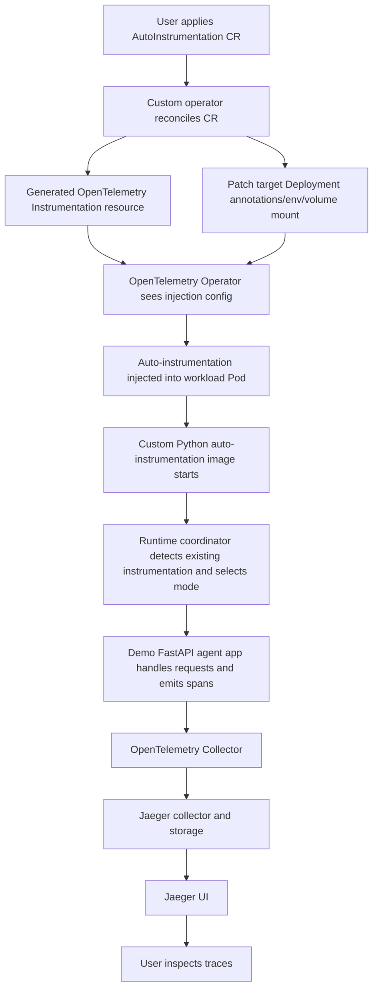

# Architecture

This document describes the architecture and design of the agent observability operator system.

## Problem Statement

Stock OpenTelemetry Operator injection is powerful, but it is **not sufficient by itself** for this agent observability use case.

Why not:

- **Injection alone does not provide a user-facing source of truth.** In this PoC, the platform contract is the custom `AutoInstrumentation` resource, not a manually authored `Instrumentation` object.
- **Injection alone does not decide instrumentation ownership.** Python agent workloads may have no tracing, partial tracing signals, or fully user-owned tracing already in place. A blanket auto-instrumentation startup path risks duplicate spans, conflicting SDK setup, or overriding app-owned tracing.
- **Injection alone does not express runtime coordination policy.** This PoC needs startup-time instrumentation decisions for each framework and component, based on detection of what's already configured or instrumented.
- **Injection alone does not ship the custom runtime behavior.** The PoC uses a custom Python auto-instrumentation image that contains curated instrumentation packages plus a runtime coordinator invoked via `sitecustomize.py`.
- **Injection alone does not prepare the workload the way this demo needs.** The custom operator patches the target workload, mounts runtime coordinator config, writes OTLP settings, and points the OTel Operator at the generated `Instrumentation` resource.

In short: the standard OTel Operator remains an important part of the system, but this PoC demonstrates the extra control plane and runtime policy required to make agent observability safer and more intentional for Python workloads.

## What This PoC Demonstrates

This repository demonstrates all of the following, end to end:

- **custom CR as source of truth** via `AutoInstrumentation` resources that describe the target workload, generated instrumentation, and runtime coordinator settings.
- **generated OpenTelemetry `Instrumentation` resources** created by the custom operator rather than managed manually by the user.
- **Workload patching for OTel Operator injection** so Deployments are annotated and configured for Python auto-instrumentation.
- **A custom Python auto-instrumentation image** that packages OTel libraries and instrumentors but delegates activation policy to the runtime coordinator.
- **A runtime coordinator** that detects existing tracing ownership signals and makes fine-grained instrumentation decisions at startup.
- **Collector + Jaeger backend wiring** so traces travel from the demo agent app to the OpenTelemetry Collector and then to Jaeger.
- **three instrumentation ownership cases** represented by demo apps:
  - `no-existing`: no tracing setup; coordinator should initialize provider and instrument all available frameworks
  - `partial-existing`: some tracing ownership signals exist; coordinator should make selective decisions
  - `full-existing`: app fully owns provider/exporter and some manual instrumentation; coordinator should respect existing setup

## System Architecture

### End-to-End Flow



### Telemetry Path

```text
agent app
  -> OTLP HTTP (agent-observability-collector.observability.svc.cluster.local:4318)
  -> OpenTelemetry Collector
  -> Jaeger collector
  -> Jaeger UI (agent-observability-jaeger.observability.svc.cluster.local:16686)
```

### Stable Service Names

- Collector: `agent-observability-collector.observability.svc.cluster.local`
- Jaeger UI: `agent-observability-jaeger.observability.svc.cluster.local`
- Demo apps:
  - `agent-no-existing.demo-apps.svc.cluster.local`
  - `agent-partial-existing.demo-apps.svc.cluster.local`
  - `agent-full-existing.demo-apps.svc.cluster.local`
  - `mock-mcp-server.demo-apps.svc.cluster.local`
  - `mock-external-http-service.demo-apps.svc.cluster.local`

## Component Architecture

### Control Plane (Operator)

The custom Kubernetes operator reconciles `AutoInstrumentation` CRs into:

1. **OpenTelemetry `Instrumentation` resources** - Generated in target namespace
2. **Runtime coordinator `ConfigMap`** - Contains heuristics/patchers settings
3. **Workload patches** - Adds annotations and configuration to target Deployments:
   - `instrumentation.opentelemetry.io/inject-python` annotation
   - `instrumentation.opentelemetry.io/container-names` annotation
   - OTLP environment variables in selected container
   - Mounted runtime coordinator config file

#### Operator Code Structure

The operator uses a **plugin architecture** for extensibility:

- `operator/main.go` - operator entrypoint, manager setup
- `operator/api/v1alpha1/agentobservability_types.go` - CRD API types (AutoInstrumentation spec/status)
- `operator/internal/controller/agentobservability_controller.go` - reconciliation logic (plugin-driven)
- `operator/internal/controller/plugins/` - plugin implementations:
  - `plugin.go` - InstrumentationPlugin interface
  - `registry.go` - explicit plugin registry
  - `{library}.go` - per-library plugins (fastapi, httpx, requests, langchain, mcp)
  - `common/helpers.go` - shared type checking/conversion utilities
- `operator/stubs/` - type stubs for k8s and OTel Operator APIs (used instead of full dependencies)
- `scripts/generate-plugin-fields.sh` - generates CRD fields from plugin registry

#### Real Dependency Model

The runnable operator links against real upstream Go modules:

- `sigs.k8s.io/controller-runtime`
- `k8s.io/api`, `k8s.io/apimachinery`, and `k8s.io/client-go`
- `github.com/go-logr/logr`
- `github.com/open-telemetry/opentelemetry-operator`

Local stub replacements are no longer part of the runtime design.

### Runtime Plane (Python Coordinator)

The runtime coordinator makes startup-time instrumentation decisions using a **plugin architecture**:

#### Startup Flow

```text
Python start
  -> sitecustomize.py runs
  -> runtime coordinator runs
  -> coordinator loads config
  -> coordinator detects existing instrumentation
  -> coordinator makes per-plugin decisions
  -> coordinator activates selected instrumentors
```

#### Runtime Coordinator Structure

- `runtime-coordinator/agent_obs_runtime/bootstrap.py` - startup orchestration (plugin-driven)
- `runtime-coordinator/agent_obs_runtime/instrumentation.py` - TracerProvider initialization only
- `runtime-coordinator/agent_obs_runtime/plugins/` - plugin implementations:
  - `base.py` - InstrumentationPlugin abstract base class
  - `registry.py` - explicit plugin registry
  - `{library}.py` - per-library plugins (fastapi, httpx, requests, langchain, mcp)
  - `common/` - shared utilities:
    - `ownership.py` - OwnershipResolver state machine
    - `wrapper_utils.py` - thread-local context, diagnostics
    - `detection_utils.py` - library availability/instrumentation checks
- `custom-python-image/src/sitecustomize.py` - invokes coordinator at Python startup (replaces OTel operator's sitecustomize.py)

#### Decision Logic (Plugin-Based)

The coordinator uses a **plugin architecture** where each instrumentation library is implemented as a plugin. Plugins make independent decisions for each instrumentation target:

- **initialize_provider**: Initialize TracerProvider if only ProxyTracerProvider detected
- **Per-plugin instrumentation**: Each plugin decides whether to instrument based on config (true/false/"auto")
  - **Auto-detection plugins** (FastAPI, HTTPX, Requests): Support runtime ownership resolution
  - **Explicit-only plugins** (LangChain, MCP): Require explicit true/false configuration

### Custom Python Auto-Instrumentation Image

The image is a **capability bundle** that separates **installed capability** from **runtime activation policy**:

- Packages OpenTelemetry core libraries and instrumentors
- Includes runtime coordinator as `agent_obs_runtime`
- Uses `sitecustomize.py` to invoke coordinator at Python startup
- Coordinator decides which instrumentors to activate

#### Key Differences from Stock OTel Auto-Instrumentation

| Aspect | Stock OTel | Custom Image |
|--------|-----------|--------------|
| Activation | Eager, all instrumentors | Selective, coordinator-controlled |
| Decision point | Build time / startup flags | Runtime detection |
| Ownership handling | No awareness | Detects and respects app ownership |
| Configuration | Environment variables | ConfigMap + env vars + detection |

## Plugin Architecture

The system uses an explicit plugin architecture for extensibility. Each instrumentation library is implemented as a plugin with corresponding Go and Python implementations.

### Plugin Interface

**Python (`InstrumentationPlugin` base class):**
- `name` - Plugin identifier (e.g., "fastapi")
- `supports_auto_detection` - Whether plugin supports runtime ownership resolution
- `should_instrument(config_value)` - Decision logic based on config
- `dependencies()` - List of pip packages required
- `instrument()` - Perform instrumentation
- `detect_ownership()` - (Optional) Detect if app already instrumented
- `install_ownership_wrappers(resolver)` - (Optional) Install ownership detection wrappers

**Go (`InstrumentationPlugin` interface):**
- `Name()` - Plugin identifier
- `SupportsAutoDetection()` - Whether plugin supports runtime ownership resolution
- `IsTrue(value)`, `IsFalse(value)`, `IsAuto(value)` - Type checking
- `ResolveField(value, defaultBool)` - Field resolution with defaults
- `ValueToString(value)` - Convert value to string for diagnostics
- `Validate(value)` - Validate configuration values

### Auto-Detection Pattern

Plugins that support auto-detection implement a **two-wrapper approach**:

1. **Instrumentor API Wrapper**: Wraps `YourInstrumentor.instrument()` to observe app ownership claims
2. **First-Use Wrapper**: Wraps library entry points to detect first use for platform claims

See `httpx.py` for a complete reference implementation.

## Configuration and Defaults

### Smart Inference System

The operator implements smart defaults with inference:

**enableInstrumentation inference:**
- If explicitly set, that value is used
- If omitted but other instrumentation fields specified → defaults to `true` (implicit opt-in)
- If omitted and no instrumentation fields specified → defaults to `false` (production-safe default)

**tracerProvider inference:**
- All library fields `true` (or default) → infers `platform` (coordinator initializes TracerProvider)
- At least one library field `false` → infers `app` (app owns TracerProvider)
- Can be explicitly overridden if needed

**Library field defaults:**
- When `enableInstrumentation` is `true`, all library fields default to `true`
- Explicitly set to `false` to opt out for that library
- Set to `"auto"` for runtime ownership detection (auto-capable plugins only)

### Validation

The operator validates for contradictory configuration:
- Rejects CR if `enableInstrumentation: false` AND any library field explicitly set to `true`
- Rejects CR if `autoDetection: true` AND any auto-capable library has explicit value

## Known Limitations

This is intentionally a PoC and does **not** claim production completeness.

Current limitations include:

- **Timing issue: sitecustomize runs before main.py.** The runtime coordinator executes at sitecustomize time, before the application's main.py runs. This means it cannot detect what instrumentation the application will configure later, causing all three demo apps to show identical decisions despite having different tracing setups in their main.py files.
- **Heuristic detection is simplified.** The runtime coordinator uses lightweight heuristics rather than deep semantic certainty.
- **Support is limited to demo apps and selected Python flows.** The PoC focuses on FastAPI/ASGI, `httpx`, `requests`, MCP boundaries, and selected LangChain/LangGraph-style flows.
- **Operator only patches Deployment workloads** in this PoC (not StatefulSets/DaemonSets)
- **Local kind cluster only** - images are built locally and loaded into kind, not pushed to a registry

## Safety Properties

The runtime coordinator is designed around startup safety:

- Treats missing optional packages as normal
- Avoids overriding an app-owned provider
- Never instruments what's already instrumented
- Favors skip-with-logging over hard failure
- Keeps monkeypatching shallow and narrowly targeted
- Emits diagnostics even when parts of the startup pipeline fail

## Extension Points

The system can be extended in several directions:

### Additional Detection Heuristics
- Detect user-created resource attributes or service naming conventions
- Detect explicit exporter initialization patterns
- Detect app-specific framework wrappers or middleware registration

### More Plan Dimensions
- Per-target sampling policies
- Provider/exporter initialization strategies
- Richer suppression rules for specific workloads

### More Runtime Targets
- Database client instrumentation
- Queue/stream instrumentation
- Model-provider SDK instrumentation
- Deeper agent framework hooks

### Better Platform Integration
- Export startup diagnostics as structured events or metrics
- Surface runtime coordinator decisions in Kubernetes status or CR conditions
